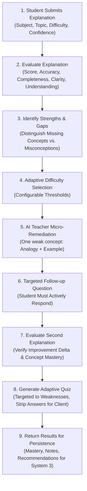

# DUALMIND — SYSTEM 2: AI LEARNING ENGINE
> **"Teach to Learn. Learn to Teach."**

DUALMIND's System 2 is an AI learning engine built on the **Feynman Technique**. It is **not** a generic conversational chatbot. Instead, it places the student in the teacher's seat: the student must actively explain concepts in their own words, while the engine evaluates their mental model, detects factual misconceptions, isolates knowledge gaps, provides targeted micro-remediation, verifies repaired understanding, and tests retention with an adaptive diagnostic quiz.

---

## 1. Core Architecture & Modules

The engine is implemented in TypeScript with strict Zod validation across all inputs, outputs, and AI responses. It runs exclusively server-side and integrates seamlessly with Next.js API route handlers, Server Actions, or standalone Node.js microservices.

```
src/lib/ai/
├── ai-provider.ts              # Provider interface, factory, error sanitizer, and JSON parser
├── mock-provider.ts            # Deterministic, content-aware mock engine for live hackathon demos
├── openai-provider.ts          # OpenAI GPT-4o / GPT-4o-mini provider with retries and JSON mode
├── gemini-provider.ts          # Google Gemini 1.5 Flash / Pro provider with responseMimeType
├── schemas.ts                  # Comprehensive Zod schemas for all inputs, outputs, and entities
├── prompts.ts                  # Prompt engineering templates and pedagogical instructions
├── evaluation-service.ts       # Multi-dimensional explanation evaluator and confidence comparison
├── knowledge-gap-service.ts    # Concept gap tracker, prioritization, and topic mastery aggregation
├── teacher-service.ts          # AI Teacher micro-pedagogy and second-turn repair verification
├── quiz-service.ts             # Adaptive diagnostic quiz generation and client-safe grading
├── recommendation-service.ts   # Next topic suggestions and spaced repetition scheduler
├── note-service.ts             # High-yield study note and flashcard generator
├── study-plan-service.ts       # Multi-phase personalized learning roadmap builder
├── fixtures/                   # Deterministic hackathon demo fixtures
│   ├── java-polymorphism.ts    # Java OOP & Dynamic Method Dispatch fixture
│   ├── dbms-normalization.ts   # DBMS Normalization (1NF-BCNF) fixture
│   ├── os-deadlocks.ts         # Operating Systems Deadlocks & Coffman conditions fixture
│   └── index.ts                # Fixture registry and discovery helper
└── index.ts                    # Main library barrel export for System 3
```

---

## 2. The 9-Step Main Learning Loop



1. **Input**: Student submits their explanation of a topic alongside their self-rated confidence (1–5 or 0–100%).
2. **Evaluation**: Evaluates conceptual correctness, mechanistic understanding, completeness, and clarity.
3. **Gap & Misconception Analysis**: Distinguishes shallow/omitted concepts from actively inverted beliefs or false assumptions.
4. **Adaptive Difficulty**: Dynamically recalibrates target difficulty.
5. **AI Teacher Mode**: Isolates the single weakest concept and generates a focused micro-lesson with an analogy and concrete code example. Does not dump an entire chapter.
6. **Active Probe**: Asks one targeted recall/application question.
7. **Repair Verification**: Evaluates the student's second response to verify genuine mental model repair without false flattery.
8. **Adaptive Quiz**: Generates diagnostic questions (`mcq`, `true_false`, `fill_blank`, `short_answer`, `scenario`, `explain_concept`) targeting detected weak spots.
9. **Persistence**: Emits structured payloads for System 3 to persist in the database.

---

## 3. Provider Abstraction & Configuration

DUALMIND System 2 decouples pedagogical logic from AI providers via the `AIProvider` interface.

### Switching Providers

Configure the provider using environment variables:

```bash
# Deterministic Mock (Default - works 100% offline without API keys)
AI_PROVIDER=mock

# OpenAI (GPT-4o, GPT-4o-mini)
AI_PROVIDER=openai
AI_API_KEY=sk-proj-...
# Optional:
OPENAI_MODEL=gpt-4o
AI_FALLBACK_TO_MOCK=true

# Google Gemini (Gemini 1.5 Flash, Gemini 1.5 Pro)
AI_PROVIDER=gemini
AI_API_KEY=AIzaSy...
# Optional:
GEMINI_MODEL=gemini-1.5-flash
AI_FALLBACK_TO_MOCK=true
```

### Fallback Policy & Safety

- **Missing API Keys**: If `AI_PROVIDER=openai` or `AI_PROVIDER=gemini` is selected but the corresponding key is missing, the engine logs a warning and **automatically falls back to the deterministic `MockProvider`**, ensuring zero crash risk.
- **Network / Rate-Limit Errors**: Real providers employ **bounded retries with exponential backoff**. If failures persist and `AI_FALLBACK_TO_MOCK=true`, the engine seamlessly fulfills the request with the mock engine.
- **Credential Sanitization**: The `AIError` class inspects error messages and stack traces to automatically redact API keys (`sk-...[REDACTED]`), preventing key leaks in log collectors or browser responses.
- **Server-Side Execution**: All providers and services run exclusively in Node.js / Next.js server environments. No client-side exposure of API tokens occurs.

---

## 4. Evaluation Quality & Rubrics

System 2 avoids the pitfalls of generic LLM grading:

| Criterion | What is Evaluated | Antipatterns Avoided |
| :--- | :--- | :--- |
| **Accuracy** (0–100) | Conceptual and factual correctness. | Does not penalize informal or colloquial phrasing if the mechanism is correct. |
| **Completeness** (0–100) | Coverage of core operational requirements. | Does not reward keyword stuffing. |
| **Clarity** (0–100) | Organization, causality, and coherence. | Does not reward long answers merely for being long. Verbose fluff is penalized. |
| **Understanding** (0–100) | Genuine mental model showing *why* and *how* something happens. | Distinguishes omission from active misconception. |

### Misconception Detection vs. Missing Concepts

- **Missing Concept**: A student omitted mentioning that 1NF requires atomic attributes. Severity: *Moderate*. Remediation: Highlight what to include.
- **Misconception**: A student stated that *"normalization is done to make SELECT read queries run faster"*. Severity: *Critical*. Remediation: Actively dispel the myth by demonstrating that normalization increases JOIN overhead to protect write integrity.

---

## 5. Adaptive Difficulty Transitions

Configurable thresholds govern difficulty adjustments:

```typescript
export interface DifficultyThresholds {
  increaseDifficultyMinScore: number; // default: 85
  maintainDifficultyMinScore: number; // default: 70
  reduceDifficultyMinScore: number;   // default: 50
}
```

- **Score 85–100**: Advance difficulty (`beginner` → `intermediate` → `advanced` → `expert`).
- **Score 70–84**: Maintain current difficulty level.
- **Score 50–69**: Step down one level and target isolated weak concepts.
- **Score below 50**: Initiate remediation mode (drops to `beginner` to reconstruct foundations).

---

## 6. Confidence vs. Understanding Analysis

Students self-rate their confidence before submitting an explanation. System 2 calculates the calibration gap (`understandingScore - confidenceScore`):

| Category | Conditions | Educational Signal |
| :--- | :--- | :--- |
| `calibrated_high` | Understanding ≥ 70, Confidence ≥ 70, Gap within ±20 | **Calibrated & Confident**: Solid grasp matches self-assurance. |
| `calibrated_low` | Understanding < 70, Confidence < 70, Gap within ±20 | **Calibrated & Self-Aware**: Accurate awareness of knowledge boundaries. |
| `overconfident` | Confidence outpaces understanding by > 20 | **Learning Opportunity**: Identifies the "illusion of competence" without shaming the student. |
| `underconfident` | Understanding outpaces confidence by > 20 | **Pleasant Surprise**: Highlights that the student knows more than they think, boosting self-efficacy. |

---

## 7. AI Teacher Mode (Micro-Pedagogy)

When a knowledge gap is identified:
1. **Single Concept Focus**: The teacher explains **only one** weak concept.
2. **Simple Language**: Jargon is deconstructed.
3. **Analogy**: Relatable real-world mental models (e.g., universal TV remote for dynamic dispatch; kitchen pantry sorting for 1NF/2NF/3NF; single-lane bridge traffic rules for Coffman conditions).
4. **Concrete Example**: Short code snippet or operational execution trace.
5. **Targeted Follow-up Question**: One question that demands active student recall before moving forward.

### Second-Turn Repair Verification

In Turn 2, the student attempts to explain the repaired concept:
- If the student **genuinely corrects** their mental model: `improvementDetected = true`, `conceptMastered = true`, positive `scoreDelta`, and `nextStep = "proceed_to_quiz"`.
- If the student **repeats the misconception** or submits low-effort text: `improvementDetected = false`, `conceptMastered = false`, `nextStep = "re_explain_with_simpler_analogy"`.

---

## 8. Adaptive Quiz Engine & Client Safety

The quiz service generates diagnostics tailored to detected weaknesses:

### Supported Question Types
- `mcq`: Multiple Choice Question with 4 distinct options.
- `true_false`: Fast binary concept verification.
- `fill_blank`: Specific technical terminology recall.
- `short_answer`: Concise conceptual explanation.
- `scenario`: Real-world architectural or debugging problem.
- `explain_concept`: Free-form explanation evaluated against rubric.

### Client-Safe Stripping Helper

To prevent answer leakage to client browser developer tools, the server uses `stripAnswersForClient()`:

```typescript
import { generateAdaptiveQuiz, stripAnswersForClient } from './lib/ai';

const fullQuiz = await generateAdaptiveQuiz({
  subject: 'Computer Science',
  topic: 'Java Polymorphism',
  weakConceptKeys: ['runtime_polymorphism_mechanism'],
  questionCount: 3,
});

// Strip correctAnswer, acceptableAnswers, gradingRubric, and explanation
const clientSafeQuiz = stripAnswersForClient(fullQuiz);
// Send clientSafeQuiz to frontend!
```

When the client posts submissions, `gradeQuizSubmission(fullQuiz, submissions)` validates and grades the student's answers.

---

## 9. Deterministic Mock Mode (Hackathon Demo Guide)

For live demonstrations and automated testing, `MockProvider` operates deterministically with **zero API key requirement**:

### Preconfigured Demo Domains

#### 1. Java Polymorphism
- **Expected Concepts**: Dynamic Method Dispatch, Overloading vs Overriding, Upcasting & Liskov Substitutability.
- **Misconception Detection**: Confusing compile-time overloading with runtime overriding; believing the reference variable type decides method execution; believing static methods can be dynamically overridden.
- **Sample Explanations**: `JAVA_POLYMORPHISM_SAMPLE_EXPLANATIONS.strong`, `.incomplete`, `.misconception`, `.poor`, `.remediated`.

#### 2. DBMS Normalization
- **Expected Concepts**: 1NF/2NF/3NF/BCNF progression, Modification Anomalies (Insert/Update/Delete), Lossless-Join & Dependency Preservation.
- **Misconception Detection**: Believing normalization improves SELECT query speed; confusing 2NF partial dependencies with 3NF transitive dependencies; believing single-column key tables can violate 2NF.
- **Sample Explanations**: `DBMS_NORMALIZATION_SAMPLE_EXPLANATIONS.strong`, `.incomplete`, `.misconception`, `.poor`, `.remediated`.

#### 3. Operating Systems Deadlocks
- **Expected Concepts**: 4 Coffman conditions simultaneity (Mutual Exclusion, Hold & Wait, No Preemption, Circular Wait), Handling Strategies (Prevention, Banker's Avoidance, Detection, Ostrich), Deadlock vs Starvation & Livelock.
- **Misconception Detection**: Believing all 4 Coffman conditions must be eliminated to prevent deadlock; confusing deadlock with starvation; assuming an unsafe state in Banker's algorithm equals an existing deadlock.
- **Sample Explanations**: `OS_DEADLOCKS_SAMPLE_EXPLANATIONS.strong`, `.incomplete`, `.misconception`, `.poor`, `.remediated`.

---

## 10. API Integration Guide for System 3

System 3 owns routing and persistence. System 2 exports high-level functions that return typed, validated data:

```typescript
import {
  evaluateExplanation,
  teachWeakConcept,
  evaluateFollowupExplanation,
  generateAdaptiveQuiz,
  gradeQuizSubmission,
  stripAnswersForClient,
  knowledgeGapService,
  generateRecommendations,
  generateStudyNote,
  generateStudyPlan,
} from './lib/ai';

// 1. Initial Evaluation Route Handler
export async function handleEvaluation(req: Request) {
  const body = await req.json();
  const result = await evaluateExplanation(body);
  // Persist result to database (System 3)
  return Response.json(result);
}

// 2. Micro-Teacher Route Handler
export async function handleTeachWeakConcept(req: Request) {
  const body = await req.json();
  const lesson = await teachWeakConcept(body);
  return Response.json(lesson);
}

// 3. Second Turn Repair Route Handler
export async function handleFollowupEvaluation(req: Request) {
  const body = await req.json();
  const repairResult = await evaluateFollowupExplanation(body);
  return Response.json(repairResult);
}

// 4. Adaptive Quiz Generation Route Handler
export async function handleGenerateQuiz(req: Request) {
  const body = await req.json();
  const quiz = await generateAdaptiveQuiz(body);
  // Save quiz with correct answers in DB (System 3)
  const clientSafeQuiz = stripAnswersForClient(quiz);
  return Response.json(clientSafeQuiz);
}

// 5. Quiz Submission Grading Route Handler
export async function handleGradeQuiz(req: Request) {
  const { quizId, submissions } = await req.json();
  // Fetch full stored quiz from DB (System 3)
  const storedQuiz = await fetchQuizFromDb(quizId);
  const gradeResult = await gradeQuizSubmission(storedQuiz, submissions);
  return Response.json(gradeResult);
}
```

---

## 11. Testing & Verification

The suite includes 40 unit and integration tests covering evaluation rubrics, invalid JSON recovery, adaptive difficulty, calibration math, teacher repair verification, and mock fixtures.

To execute tests and verify type safety:

```bash
# Type check TypeScript codebase
npm run typecheck

# Build library to dist/
npm run build

# Run full test suite
npm test
```

### Test Results
- **40 tests passing across 14 test suites**
- **0 failed, 0 skipped, 0 canceled**
- Execution time: ~500ms

---

## 12. Limitations & Design Boundaries

1. **Server-Side Exclusivity**: System 2 services should never be bundled into client-side browser bundles because real providers require API secrets.
2. **Stateless Service Design**: System 2 does not maintain in-memory session states or database connections; conversation state and student history are passed as inputs and returned as outputs for System 3 to persist.
3. **No Database Coupling**: Database schemas, ORMs (e.g. Prisma), and user authentication are intentionally omitted and belong to System 3.
4. **Deterministic Mock Extensibility**: While preconfigured fixtures cover Java OOP, DBMS, and OS Deadlocks, additional subjects can be added to `src/lib/ai/fixtures/` following the `TopicFixture` schema.
