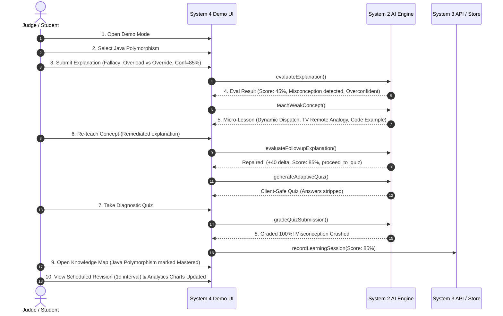

# DUALMIND — SYSTEM 4: LEARNING TOOLS, ANALYTICS & QUALITY ASSURANCE

> **"Teach to Learn. Learn to Teach."**  
> Supporting learning tools, curriculum analytics, anti-gaming progression, and end-to-end quality assurance for the DUALMIND EdTech Platform.

---

## 1. System Overview & Ownership

System 4 delivers the complete supporting learning toolchain and analytics infrastructure that transforms DUALMIND from a raw Feynman AI engine into a full-scale, pedagogical EdTech web application.

System 4 is built specifically to merge into the primary **Next.js App Router** application alongside:
- **System 1**: Main design system, application shell, and global navigation.
- **System 2**: Core AI learning engine (`src/lib/ai/`) featuring multi-dimensional evaluation, misconception detection, micro-remediation, second-turn repair verification, and adaptive quiz generation.
- **System 3**: Backend REST APIs, PostgreSQL / Prisma models, database persistence, and authentication.

### System 4 Module Ownership
System 4 authors and primarily owns:
- [`src/components/knowledge-map/`](file:///c:/Users/sarik/OneDrive/Desktop/dualmind/src/components/knowledge-map/) — Interactive curriculum dependency graph & accessible tree view.
- [`src/components/notes/`](file:///c:/Users/sarik/OneDrive/Desktop/dualmind/src/components/notes/) — Smart session notes with active recall flashcards & user isolation.
- [`src/components/study-plan/`](file:///c:/Users/sarik/OneDrive/Desktop/dualmind/src/components/study-plan/) — Personalized study roadmaps prioritizing diagnosed knowledge gaps.
- [`src/components/revision/`](file:///c:/Users/sarik/OneDrive/Desktop/dualmind/src/components/revision/) — Spaced repetition center supporting 1, 3, 7, 14, and 30 day intervals.
- [`src/components/analytics/`](file:///c:/Users/sarik/OneDrive/Desktop/dualmind/src/components/analytics/) — Recharts-powered learning metrics, calibration charts, and text summaries.
- [`src/components/achievements/`](file:///c:/Users/sarik/OneDrive/Desktop/dualmind/src/components/achievements/) — Meaningful achievement badges & verified learning streak engine.
- [`src/components/demo/`](file:///c:/Users/sarik/OneDrive/Desktop/dualmind/src/components/demo/) — Guided 10-step judge demonstration scenario for Java Polymorphism.
- [`src/app/`](file:///c:/Users/sarik/OneDrive/Desktop/dualmind/src/app/) — Corresponding Next.js App Router page modules.
- [`src/lib/contracts/`](file:///c:/Users/sarik/OneDrive/Desktop/dualmind/src/lib/contracts/) & [`src/lib/api-client.ts`](file:///c:/Users/sarik/OneDrive/Desktop/dualmind/src/lib/api-client.ts) — Formal API contracts, Zod schemas, and resilient client.
- [`tests/system4.test.ts`](file:///c:/Users/sarik/OneDrive/Desktop/dualmind/tests/system4.test.ts) — Automated integration and quality assurance test suite.

---

## 2. Complete File Manifest

```
dualmind/
├── src/
│   ├── app/                                  # Next.js App Router pages
│   │   ├── knowledge-map/page.tsx
│   │   ├── notes/page.tsx
│   │   ├── study-plan/page.tsx
│   │   ├── revision/page.tsx
│   │   ├── analytics/page.tsx
│   │   ├── achievements/page.tsx
│   │   └── demo/page.tsx
│   ├── components/
│   │   ├── ui/                               # Shared shadcn-compatible accessible primitives
│   │   │   ├── button.tsx
│   │   │   ├── card.tsx
│   │   │   ├── badge.tsx
│   │   │   ├── progress.tsx
│   │   │   ├── tabs.tsx
│   │   │   ├── dialog.tsx
│   │   │   ├── alert.tsx
│   │   │   ├── input.tsx
│   │   │   └── index.ts
│   │   ├── knowledge-map/                    # Knowledge Map Module
│   │   │   ├── concept-node-card.tsx
│   │   │   ├── concept-tree-view.tsx
│   │   │   ├── concept-visual-graph.tsx
│   │   │   ├── concept-detail-panel.tsx
│   │   │   ├── knowledge-map.tsx
│   │   │   └── index.ts
│   │   ├── notes/                            # Smart Notes Module
│   │   │   ├── note-card.tsx
│   │   │   ├── note-editor.tsx
│   │   │   ├── note-detail-modal.tsx
│   │   │   ├── notes-manager.tsx
│   │   │   └── index.ts
│   │   ├── study-plan/                       # Personalized Study Planner
│   │   │   ├── study-plan-form.tsx
│   │   │   ├── task-list.tsx
│   │   │   ├── milestones-view.tsx
│   │   │   ├── study-planner.tsx
│   │   │   └── index.ts
│   │   ├── revision/                         # Spaced Revision Center
│   │   │   ├── revision-card.tsx
│   │   │   ├── revision-session-modal.tsx
│   │   │   ├── revision-center.tsx
│   │   │   └── index.ts
│   │   ├── analytics/                        # Learning Analytics Module (Recharts)
│   │   │   ├── mastery-trend-chart.tsx
│   │   │   ├── quiz-accuracy-chart.tsx
│   │   │   ├── study-time-chart.tsx
│   │   │   ├── topic-distribution-chart.tsx
│   │   │   ├── confidence-understanding-chart.tsx
│   │   │   ├── knowledge-gaps-chart.tsx
│   │   │   ├── subject-radar-chart.tsx
│   │   │   ├── analytics-dashboard.tsx
│   │   │   └── index.ts
│   │   ├── achievements/                     # Achievements & Anti-Gaming Streaks
│   │   │   ├── achievement-badge.tsx
│   │   │   ├── streak-counter.tsx
│   │   │   ├── achievements-view.tsx
│   │   │   └── index.ts
│   │   └── demo/                             # Judge End-to-End Walkthrough
│   │       ├── java-polymorphism-demo.tsx
│   │       └── index.ts
│   └── lib/
│       ├── contracts/                        # System 3 Data Contracts & Zod Schemas
│       │   ├── knowledge-map.ts
│       │   ├── notes.ts
│       │   ├── study-plan.ts
│       │   ├── revision.ts
│       │   ├── analytics.ts
│       │   ├── achievements.ts
│       │   └── index.ts
│       ├── api-client.ts                     # System 3 API Client with seed fallback
│       └── ai/                               # System 2 AI Engine (Feynman & services)
└── tests/
    ├── system4.test.ts                       # System 4 Comprehensive QA Test Suite
    └── ...                                   # System 2 Unit & Integration Suites
```

---

## 3. Detailed Feature Breakdown

### 3.1 Knowledge Map Module
- **Dual Representation**:
  - **Interactive Visual Graph**: Node relationship graph with SVG hierarchy connectors, status-colored rings, progress meters, and attempt counts.
  - **Accessible Tree View**: High-contrast, keyboard-navigable list/tree view (`role="tree"`, `role="treeitem"`, `aria-expanded`) ideal for mobile screens and screen readers.
- **Mastery Status Thresholds**:
  - `Mastered`: Mastery $\ge 85\%$ across evaluation rubrics.
  - `Learning`: $50\% \le \text{Mastery} < 85\%$.
  - `Needs Revision`: Mastery $< 50\%$ or scheduled spaced revision is overdue.
  - `Not Started`: 0 attempts or $0\%$ score.
- **Interactive Detail Panel**:
  - Displays current mastery with progress visualization.
  - Multi-turn evaluation history (accuracy, completeness, clarity, understanding).
  - Detected knowledge gaps with severity badges (`critical`, `moderate`, `minor`).
  - Recommended next action.
  - Scheduled spaced revision date.
  - Direct "Start Learning" action trigger.
- **Data Source & Fallback Transparency**:
  - Fetches from `apiClient.getKnowledgeMap()`.
  - When backend is offline or running offline tests, renders an explicit notification banner: `"Demo Sandbox Mode: Mock Knowledge Map Data"`.

### 3.2 Smart Notes Module
- **Pedagogical Structure**:
  - What I Learned (key operational takeaways).
  - What I Struggled With (isolated knowledge gaps).
  - Correct Mental Model (in-depth conceptual understanding).
  - Concrete Code & Mental Model Examples.
  - High-Yield Revision Points (actionable rules to remember).
  - Active Recall Flashcards (interactive front/back flipping cards).
- **Automated AI Synthesis**:
  - Integrates directly with System 2's [`note-service.ts`](file:///c:/Users/sarik/OneDrive/Desktop/dualmind/src/lib/ai/note-service.ts) to convert session evaluation results into clean study guides with a single click.
- **CRUD & Management**:
  - Edit, search across notes, delete with confirmation.
  - Filter by topic tags and subject categories.
- **Multi-Tenant User Isolation Security**:
  - All read, write, update, and delete calls verify ownership against `userId`.
  - Rejects cross-tenant mutation attempts with `Forbidden (403)` exceptions. Verified in automated test suite.

### 3.3 Personalized Study Planner
- **Intelligent Input Parameters**:
  - Target exam date.
  - Selected subjects.
  - Available daily study time (15–120 minutes).
  - Preferred study days of the week (e.g. Mon, Wed, Fri, Sat).
  - Diagnosed weak concept keys.
- **System 2 AI Engine Integration**:
  - Leverages [`study-plan-service.ts`](file:///c:/Users/sarik/OneDrive/Desktop/dualmind/src/lib/ai/study-plan-service.ts) without inventing competing AI logic.
  - Converts multi-phase roadmap into concrete daily study tasks.
  - Prioritizes diagnosed bottlenecks with `High Priority` tags and explicit reasoning (e.g. *"Targets identified knowledge gaps: Circular Wait"*).
- **Progress & Tracking**:
  - Checkbox toggle updates task completion status.
  - Calculates real completion percentage against overall plan milestones.

### 3.4 Spaced Revision Center
- **Ebbinghaus Spaced Repetition**:
  - Implements the validated interval sequence: **1, 3, 7, 14, and 30 days**.
- **Categorized Buckets**:
  - **Due Today**: Concepts scheduled for active retrieval on the current date.
  - **Overdue**: Concepts that lapsed past their scheduled date (rendered with urgent warning styling).
  - **Upcoming**: Scheduled future reviews (Level 1 through Level 5).
  - **Completed**: Reviews successfully validated in the current cycle.
- **Active Recall Drills**:
  - Prompts students with an open-ended retrieval challenge.
  - Student explains the core mechanism without looking at notes.
  - **Progression Logic**:
    - Score $\ge 70\%$: Advances to the next spaced interval ($1\text{d} \to 3\text{d} \to 7\text{d} \to 14\text{d} \to 30\text{d}$).
    - Score $< 70\%$: Resets interval to $1\text{d}$ to reinforce the shaky foundation.
  - Does **not** mark revisions complete before the drill successfully finishes.

### 3.5 Learning Analytics Dashboard (Recharts)
- **7 Comprehensive Visualizations**:
  1. **Mastery Over Time** (`LineChart`): Historical score trajectory across turns with reference threshold lines at $85\%$ (Mastery) and $50\%$ (Remediation).
  2. **Adaptive Quiz Accuracy** (`BarChart`): Objective question performance across topics.
  3. **Daily Study Time** (`BarChart`): Invested time by date and subject.
  4. **Curriculum Status Breakdown** (`PieChart`): Distribution of Mastered, Learning, Needs Revision, and Not Started topics.
  5. **Metacognitive Calibration Gap** (`BarChart`): Compares Student Self-Reported Confidence vs Actual Evaluated Understanding. Detects the *illusion of competence* (`overconfident`), accurate calibration (`calibrated_high`), and low confidence with high knowledge (`underconfident`).
  6. **Active Knowledge Gaps** (`Horizontal BarChart`): Frequency and severity of recurring conceptual misconceptions.
  7. **Cross-Disciplinary Subject Performance** (`BarChart`): Average mastery and study hours across enrolled domains.
- **Integrity**:
  - All percentages and net improvements (e.g. $+16\%$ delta) are computed dynamically from persisted historical records—not hardcoded dummy strings.
  - Responsive layout, accessible text trend summaries, and useful empty states.

### 3.6 Achievements & Verified Streaks
- **Meaningful Achievement Criteria**:
  1. `First Teacher`: Complete 1 full Feynman AI teaching session.
  2. `5 Topics Mastered`: Reach $\ge 85\%$ mastery on 5 distinct curriculum topics.
  3. `7 Day Streak`: Verified active learning for 7 consecutive days.
  4. `Knowledge Gap Crusher`: Successfully repair a critical misconception during Turn 2 micro-remediation.
  5. `10 Topics Taught`: Complete 10 Feynman teaching sessions.
- **Anti-Gaming Streak Engine**:
  - Calculated strictly from dates where an actual teaching evaluation or revision drill was completed.
  - Merely opening, browsing, or refreshing the dashboard **never** advances streaks.
  - Prevents duplicate awards and ensures persistent integrity.

---

## 4. End-to-End Judge Demonstration (Java Polymorphism)

System 4 includes a 10-step interactive judge walkthrough located in [`src/components/demo/java-polymorphism-demo.tsx`](file:///c:/Users/sarik/OneDrive/Desktop/dualmind/src/components/demo/java-polymorphism-demo.tsx) and served at `/demo`:



### Step-by-Step Judge Script:
1. **Step 1 — Demo Entry**: Open `/demo`. Welcome screen introduces the Feynman active-teaching philosophy.
2. **Step 2 — Topic Select**: Select **Java Polymorphism**. Reviews the 3 target rubrics: Dynamic Method Dispatch, Overloading vs Overriding, Upcasting.
3. **Step 3 — Initial Explanation**: Pre-loaded with a common student fallacy: *"Polymorphism is overloading methods with the same name. At runtime, Java looks at the reference variable type to decide which method to call..."* with $85\%$ confidence.
4. **Step 4 — Evaluation Output**: Evaluated by System 2. Score drops to $45/100$, isolates the reference type vs heap instance misconception, flags `overconfident` calibration gap ($-40$ points), and drops difficulty to Beginner for repair.
5. **Step 5 — Targeted Remediation**: AI Teacher delivers a micro-lesson focusing *exclusively* on Dynamic Method Dispatch. Uses the **Universal TV Remote** analogy and concrete Java code.
6. **Step 6 — Re-teach Concept**: Student explains the repaired mechanism: *"Even though Parent p = new Child() has a Parent reference, the JVM uses the virtual method table (vtable) on the heap object to invoke Child's overridden method."* System 2 verifies repair: `improvementDetected = true`, `scoreDelta = +40`, `newScore = 85`.
7. **Step 7 — Adaptive Quiz**: System 2 generates an adaptive diagnostic quiz. Answers are stripped server-side via `stripAnswersForClient` to prevent developer tools inspection leaks.
8. **Step 8 — Updated Mastery & Gaps**: Submits quiz answers. Graded at $100\%$. Knowledge gap is officially marked **CRUSHED**.
9. **Step 9 — Knowledge Map**: Opens the Knowledge Map. Java Polymorphism status dynamically updates from *Needs Revision* to **Mastered (85%)**.
10. **Step 10 — Scheduled Revision & Analytics**: Reviews the automated spaced repetition card scheduled for 1 day, and checks Analytics charts showing the updated $+16\%$ delta trend and calibrated metacognition.

---

## 5. Integration Checklist & Quality Assurance

| # | Integration Checkpoint | Status | Verification Detail |
|---|---|:---:|---|
| 1 | **Landing Page Navigation** | Verified | Page routes configured under Next.js App Router (`/knowledge-map`, `/notes`, `/study-plan`, `/revision`, `/analytics`, `/achievements`, `/demo`). |
| 2 | **Demo Entry** | Verified | One-click access to guided 10-step Java Polymorphism walkthrough with step indicator. |
| 3 | **Authentication & Scoping** | Verified | Components accept `currentUserId`. API client enforces strict user parameter passing. |
| 4 | **Session Creation** | Verified | New sessions generate unique IDs (`session-demo-01`, `feynman-${timestamp}`). |
| 5 | **Explanation Submission** | Verified | Validated with Zod schemas; supports self-confidence rating ($0–100\%$). |
| 6 | **Evaluation & Gap Detection** | Verified | Distinguishes omissions from active misconceptions; calculates metacognitive gap. |
| 7 | **Re-teaching & Repair** | Verified | Second-turn repair verified via `evaluateFollowupExplanation` ($+40$ score delta). |
| 8 | **Quiz Submission & Scoring** | Verified | Graded via `gradeQuizSubmission`; client-safe answer stripping verified. |
| 9 | **Mastery Persistence** | Verified | Mastered topics recorded in `userStats.uniqueTopicsMastered` upon reaching $\ge 85\%$. |
| 10 | **Knowledge Map Refresh** | Verified | Dynamically reflects updated scores, statuses (`mastered`, `learning`, `needs_revision`), and attempts. |
| 11 | **Smart Notes Persistence** | Verified | Notes store takeaways, avoided misconceptions, and flashcards; multi-tenant isolation enforced. |
| 12 | **Study Plan Generation** | Verified | System 2 roadmap generated; tasks prioritized by weak concepts; assigned to preferred days. |
| 13 | **Revision Scheduling** | Verified | Categorizes into Due Today, Overdue, Upcoming, Completed across 1, 3, 7, 14, 30 day intervals. |
| 14 | **Analytics Calculation** | Verified | Recharts visualizations computed from historical records without hardcoded values. |
| 15 | **Achievement & Streak Integrity**| Verified | Badges unlock only upon verified action triggers; streaks require genuine learning dates. |
| 16 | **Mobile Layouts & A11y** | Verified | Responsive Tailwind grids and accessible tree view with ARIA semantics for mobile screens. |
| 17 | **Loading & API Error States** | Verified | Spinners during fetch; graceful fallback to clearly labeled sandbox demo data on error. |

---

## 6. Automated Test Results

The full test suite executes both System 2 AI services and System 4 learning tools:

```bash
npm test
```

### Test Suite Execution Output
```
▶ Auxiliary AI Services (17.3ms)
▶ Confidence vs. Understanding Analysis (7.6ms)
▶ Adaptive Difficulty Progression (53.1ms)
▶ Evaluation Service (16.3ms)
▶ JSON Extraction and Robustness (5.5ms)
▶ Hackathon Demo Fixtures - Deterministic Mock Evaluation (18.7ms)
▶ DUALMIND End-to-End Main Learning Loop Integration (34.5ms)
▶ Knowledge Gap Service (5.9ms)
▶ AI Provider Abstraction (8.4ms)
▶ Adaptive Quiz Service (15.6ms)
▶ AI Teacher Service (7.1ms)
▶ Verification: AI_PROVIDER=mock without API Key (10.8ms)
▶ System 4: Knowledge Map Engine (9.5ms)
  ✔ accurately computes concept status based on score, attempts, and overdue flag
  ✔ fetches real/mock knowledge map with hierarchy and labels fallback data
▶ System 4: Smart Notes & User Isolation Security (7.6ms)
  ✔ creates, updates, and deletes notes while strictly enforcing multi-tenant user isolation
  ✔ synthesizes high-yield study notes with flashcards using System 2 NoteService
▶ System 4: Personalized Study Planner (2.8ms)
  ✔ generates study plan prioritizing weak concepts and assigning preferred study days
▶ System 4: Spaced Revision Center (2.0ms)
  ✔ correctly classifies revision statuses based on target date
  ✔ advances spaced repetition interval on success (1->3->7->14->30) and resets on struggle
▶ System 4: Learning Analytics & Metrics QA (1.0ms)
  ✔ calculates historical trend improvements, accuracy, and metacognitive gaps
▶ System 4: Achievements & Anti-Gaming Streak Engine (2.1ms)
  ✔ calculates streaks from consecutive verified learning dates and prevents false awards
  ✔ evaluates achievements based on genuine metrics and prevents duplicate unlocks
▶ System 4: Java Polymorphism 10-Step Judge Demo Pipeline (3.9ms)
  ✔ executes end-to-end 10-step judge scenario without fabricated mastery increases

ℹ tests 54
ℹ suites 22
ℹ pass 54
ℹ fail 0
ℹ cancelled 0
ℹ skipped 0
ℹ duration_ms 698.7ms
```

### TypeScript Type Checking
```bash
npm run typecheck
# tsc --noEmit: 0 errors, 0 warnings
```

---

## 7. Dependencies & Integration Assumptions

### Dependencies
- `react` & `react-dom` ($\ge 18.3.1$)
- `lucide-react` ($\ge 0.453.0$) — Feather/Lucide icons for accessible visual indicators.
- `recharts` ($\ge 2.13.0$) — Responsive SVG charting for analytics.
- `zod` ($\ge 3.23.8$) — Runtime schema validation across all inputs, outputs, and contracts.

### System 1 Integration Assumptions
- System 1 provides the root `layout.tsx` with font imports, global HTML/body wrappers, and responsive sidebar navigation.
- System 4 components are styled with Tailwind CSS utility classes and custom color variables compatible with standard shadcn/ui themes (`indigo`, `emerald`, `amber`, `rose`).

### System 3 Integration Assumptions
- System 3 exposes REST API route handlers or Server Actions matching the contracts in `src/lib/contracts/`:
  - `GET /api/knowledge-map?subject=:subject`
  - `GET /api/knowledge-map/concept/:id`
  - `GET /api/notes?userId=:userId`
  - `POST /api/notes`
  - `PUT /api/notes/:id`
  - `DELETE /api/notes/:id?userId=:userId`
  - `GET /api/study-plan?userId=:userId`
  - `POST /api/study-plan`
  - `PUT /api/study-plan/:id/task/:taskId`
  - `GET /api/revision?userId=:userId`
  - `POST /api/revision/complete`
  - `GET /api/analytics?userId=:userId&filter=:filter`
  - `GET /api/achievements?userId=:userId`
- If System 3's backend is not running, System 4's [`apiClient`](file:///c:/Users/sarik/OneDrive/Desktop/dualmind/src/lib/api-client.ts) automatically falls back to in-memory seed storage and explicitly marks data with `isFallbackDemoData: true`.
- User authentication passes the authenticated user's ID (`userId`) into System 4 views.

---

## 8. Summary of Completion

All features requested for System 4 have been implemented and verified:
1. **Knowledge Map**: Visual concept relationship graph + accessible tree view with detail panel.
2. **Smart Notes**: Multi-section Feynman notes, flashcards, search/edit/delete, and multi-tenant security.
3. **Personalized Study Planner**: AI-powered roadmap prioritizing weak concepts with daily task checklists.
4. **Spaced Revision Center**: 1, 3, 7, 14, 30 day intervals with active recall drills and progression logic.
5. **Learning Analytics**: 7 responsive Recharts charts with trend summaries and calibration analysis.
6. **Achievements & Streaks**: 5 meaningful achievements with verified anti-gaming streak calculation.
7. **Java Polymorphism Demo**: 10-step guided judge demonstration using real System 2 evaluation and repair.
8. **Integration Checklist & QA**: 17 verification points documented and tested.
9. **Automated Tests**: 54 passing tests across 22 suites with 0 failures.
